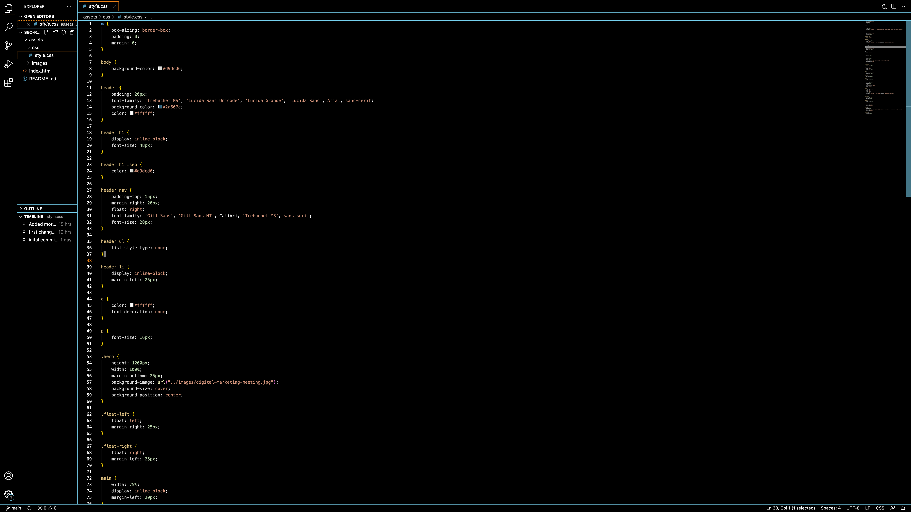
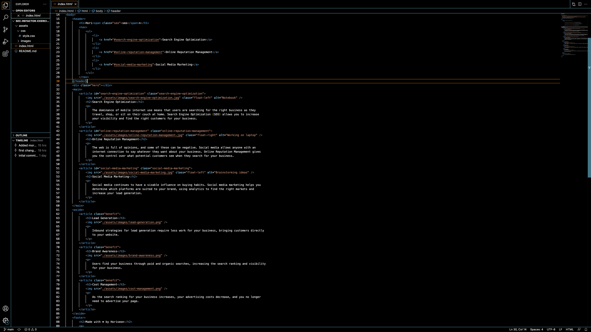

# Refactor Homework
This is homework on refactor.

## Description
This project was  meant for me to complete the following:

GIVEN a webpage meets accessibility standards
WHEN I view the source code
THEN I find semantic HTML elements
WHEN I view the structure of the HTML elements
THEN I find that the elements follow a logical structure independent of styling and positioning
WHEN I view the icon and image elements
THEN I find accessible alt attributes
WHEN I view the heading attributes
THEN they fall in sequential order
WHEN I view the title element
THEN I find a concise, descriptive title

## Usage
Here is a picture of the website final look along with some of the code that done in html and css:

